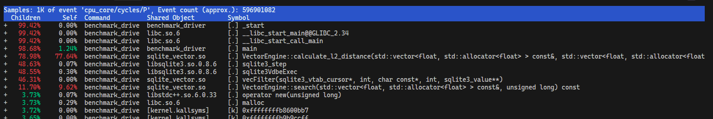

Traditional relational and document-based databases are designed for exact matching—retrieving records where an identifier matches a specific key or checking if a text field contains a exact substring. However, modern machine learning workflows depend on unstructured data, such as natural language, audio, and images. In these domains, exact matches are rare. Instead, we must determine **Semantic Similarity**.

To achieve this, unstructured data is passed through deep learning models to generate vector embeddings—numerical representations in a high-dimensional space where physical proximity corresponds to conceptual similarity.

<div class="fact-box">

A **vector database** is a specialized storage and retrieval engine designed to persist these high-dimensional embeddings and execute low-latency nearest-neighbor searches over large datasets.

</div>

In this series, we will design and implement a custom, high-performance vector database engine in C++ integrated with SQLite. This first part establishes our baseline implementation: an in-memory storage layout, an exact $k$-nearest neighbor ($k$-NN) search algorithm, an integration layer with SQLite's Virtual Table API, and an initial performance profile to guide future optimizations.

## Designing the Storage Layout: AoS vs. SoA

A naive vector database engine must support two primary operations:
1. Inserting a fixed-dimensional vector of floating-point values.
2. Executing an exact $k$-nearest neighbor search using the squared $L_2$ (Euclidean) distance metric.

Before writing the search algorithm, we must design how these vectors are laid out in memory. 

### Array of Structures (AoS)
An intuitive, object-oriented approach is to group each unique identifier with its corresponding vector in a single structure, storing these structures in a contiguous array:

```cpp
struct DbEntry {
    int64_t id_;
    std::vector<float> vector_;
};

// Database storage
std::vector<DbEntry> database_;
```

While simple, this **Array of Structures (AoS)** design introduces performance challenges during vector similarity searches. A query requires iterating over the entire database to compute distances. Under an AoS layout, this access pattern has several implications:
* When fetching a `DbEntry` into the CPU cache, we load the identifier (`id_`), which is unused during the distance computation phase.
* The actual vector data is heap-allocated elsewhere, requiring a pointer dereference for every entry.
* This non-contiguous memory access reduces memory bandwidth efficiency and cache line utilization.

### Structure of Arrays (SoA)
To mitigate these cache inefficiencies, we can restructure our database to use a **Structure of Arrays (SoA)** design. This separates the query-critical vector data from the metadata:

```cpp
class Database {
private:
    size_t dimensions_;
    std::vector<int64_t> ids_;
    std::vector<std::vector<float>> vectors_;
};
```

During a similarity search, we iterate exclusively over the `vectors_` array. Because the identifiers (`ids_`) are stored in a separate contiguous allocation, they are never loaded into the CPU cache during the computationally heavy distance-calculation loop. Once the closest vectors are identified, we use their array indices to retrieve the corresponding identifiers.

*Note: This configuration is a partial SoA implementation because the individual `std::vector<float>` objects still maintain separate heap allocations. In subsequent articles, we will explore flattening this further into a fully contiguous allocation.*

## Implementing Exact $k$-NN Search

With the storage representation established, we can implement the search logic. To evaluate the similarity between a query vector and our stored database vectors, we calculate the $L_2$ (Euclidean) distance. 

For two $n$-dimensional vectors $\mathbf{x}$ and $\mathbf{y}$, the distance is defined as:

$$
d(\mathbf{x}, \mathbf{y}) = \left( \sum_{i=1}^{n} (x_i - y_i)^2 \right)^{1/2}
$$

In performance-sensitive database engines, we typically omit the square root operation and calculate the **squared $L_2$ distance**. Because the square root function is monotonic, it preserves the relative ordering of distances while avoiding an expensive CPU instruction.

The baseline C++ implementation for this distance calculation is as follows:

```cpp
float calculate_l2_distance(const std::vector<float>& a,
                            const std::vector<float>& b) const {
    float sum = 0.0f;
    for (size_t i = 0; i < dimensions_; ++i) {
        float diff = a[i] - b[i];
        sum += diff * diff;
    }
    return sum;
}
```

### The $k$-NN Selection Process
To retrieve the top-$k$ most similar vectors relative to a query vector $\mathbf{a}$:
1. Iterate through all vectors stored in the database.
2. Calculate the squared $L_2$ distance between the query vector and each stored vector.
3. Record each result as a pair containing the vector's index/identifier and its calculated distance.
4. Sort the compiled results in ascending order of distance.
5. Extract the first $k$ entries.

We can define our search result structure like this:

```cpp
struct SearchResult {
    int64_t id;
    float distance;
};
```

To minimize memory allocation overhead during a query, we reserve memory for our results vector upfront. Since the database size is known and does not change during a read query, pre-allocating the required memory prevents repeated reallocations as we accumulate search results:

```cpp
std::vector<SearchResult> results;
results.reserve(vectors_.size());
```

## Integrating with SQLite via the Virtual Table API

To make this engine usable within standard applications, we expose our C++ storage and search components to SQLite using its **Virtual Table API**. This integration allows us to query our custom index using declarative SQL.

The Virtual Table API relies on registering a set of callback functions that handle table lifecycle operations (such as creation, connection, and destruction) and query execution.

### Defining Table and Cursor States
We define two core structures to manage the state of our virtual table and active queries:

```cpp
// Represents the virtual table instance
struct VectorVTab {
    sqlite_vtab base;
    std::unique_ptr<VectorEngine> engine;
};

// Represents an active query cursor
struct VectorCursor {
    sqlite_vtab_cursor base;
    std::vector<SearchResult> results;
    size_t current_idx;
};
```

* `VectorVTab` holds the underlying C++ search engine instance.
* `VectorCursor` represents an active search query, storing the computed results and tracking the database's progress as it iterates through them.

### Mapping SQL Queries to Vector Search
SQL does not natively support passing high-dimensional vectors or search parameters directly through standard table columns. To bridge this gap, we define a schema utilizing SQLite's `HIDDEN` column feature:

```sql
CREATE TABLE vector_table(
    id INTEGER,
    distance REAL,
    query_vector BLOB HIDDEN,
    k INTEGER HIDDEN
);
```

Hidden columns are not returned in standard select queries, but they can be passed as constraints within a `WHERE` clause. This allows us to map a declarative SQL query directly to our vector engine's search parameters:

```sql
SELECT id, distance
FROM vector_table
WHERE query_vector = ? 
  AND k = 10;
```

When SQLite processes this statement, it invokes our virtual table callbacks:
1. **`xBestIndex`** analyzes the constraints on the hidden columns (`query_vector` and `k`) and informs the SQLite query planner that it can handle these filters.
2. **`xFilter`** receives the actual parameter values bound to the query, extracts the query vector blob and the limit $k$, and calls the underlying C++ vector search.
3. The resulting `SearchResult` array is populated into `VectorCursor`.
4. **`xNext`**, **`xEof`**, and **`xColumn`** iterate over the sorted results, returning the identifiers and distances back to SQLite's virtual machine.

## Benchmarking and Profiling

With our baseline engine integrated into SQLite, we need to quantify two areas:
1. The performance cost of running queries through SQLite's Virtual Table abstraction versus calling the C++ search engine directly.
2. The core bottlenecks within our actual search implementation.

The benchmark compares a direct, raw C++ call (`VectorEngine::search`) against an identical query executed via SQL on the virtual table interface.

```bash
# Compile the project in Release mode
cmake -S . -B build-release -DCMAKE_BUILD_TYPE=Release
cmake --build build-release

# Configure CPU scaling to ensure stable benchmark runs
sudo cpupower frequency-set -g performance

# Pin execution to a single core to prevent scheduler migration overhead
taskset -c 2 ./build-release/benchmark_driver 
```

The benchmark measured the CPU cycles consumed during a search across $10,000$ vectors:

```plaintext
=== VectorEngine (Direct Call - Search Space: 10,000 vectors) (Cycles) ===
  Min:     1,116,770
  P50:     1,216,620
  P95:     2,643,618
  Max:     3,415,592
  Average: 1,403,300

=== SQLite Virtual Table (Via Virtual Interface - Search Space: 10,000 vectors) (Cycles) ===
  Min:     1,142,660
  P50:     1,350,290
  P95:     2,464,694
  Max:     3,251,712
  Average: 1,498,781
```

Exposing the search engine through the SQLite Virtual Table interface adds an average overhead of **95,481 CPU cycles** ($6.80\%$). Because this virtualization overhead is minor, it indicates that our primary performance limit lies within the search logic itself rather than the database abstraction layer.

### Bottleneck Profiling with `perf`
To isolate the exact bottlenecks within our engine, we use Linux's `perf` tool to capture execution samples:

```bash
# Rebuild with debug symbols preserved for profiling
cmake -S . -B build-perf -DCMAKE_BUILD_TYPE=RelWithDebInfo -DCMAKE_CXX_FLAGS="-O3 -g -fno-omit-frame-pointer"
cmake --build build-perf

# Configure system permissions for kernel and user-space profiling
sudo sysctl -w kernel.perf_event_paranoid=-1
sudo sysctl -w kernel.kptr_restrict=0

# Run profile sampling pinned to Core 2
taskset -c 2 perf record -F 10000 -g -- ./build-perf/benchmark_driver
```

Opening the performance report (`perf report`) reveals the distribution of CPU cycles:


*CPU cycle distribution captured during vector search profiling*

The profiling data indicates that the `VectorEngine::calculate_l2_distance` function is responsible for **77.64%** of the total execution time. 

## Conclusion and Next Steps

Our baseline implementation successfully integrates an in-memory vector storage engine with SQLite. However, our profiling data clearly identifies the core bottleneck: nearly four-fifths of our execution time is consumed by the scalar $L_2$ distance calculation loop.

In the next part of this series, we will address this bottleneck directly by exploring vectorization, utilizing SIMD (Single Instruction, Multiple Data) instructions to parallelize the distance calculations across multiple floating-point values simultaneously.